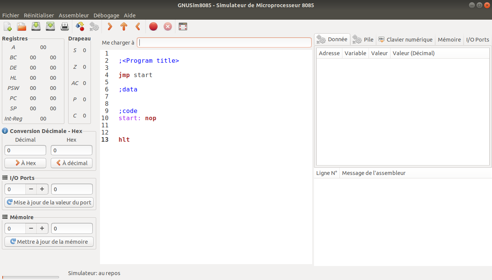
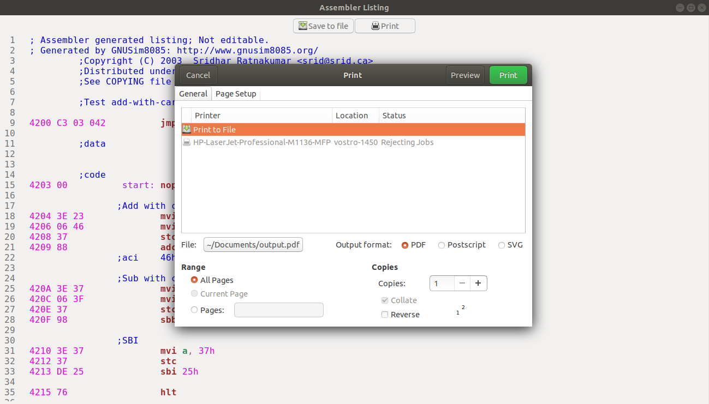
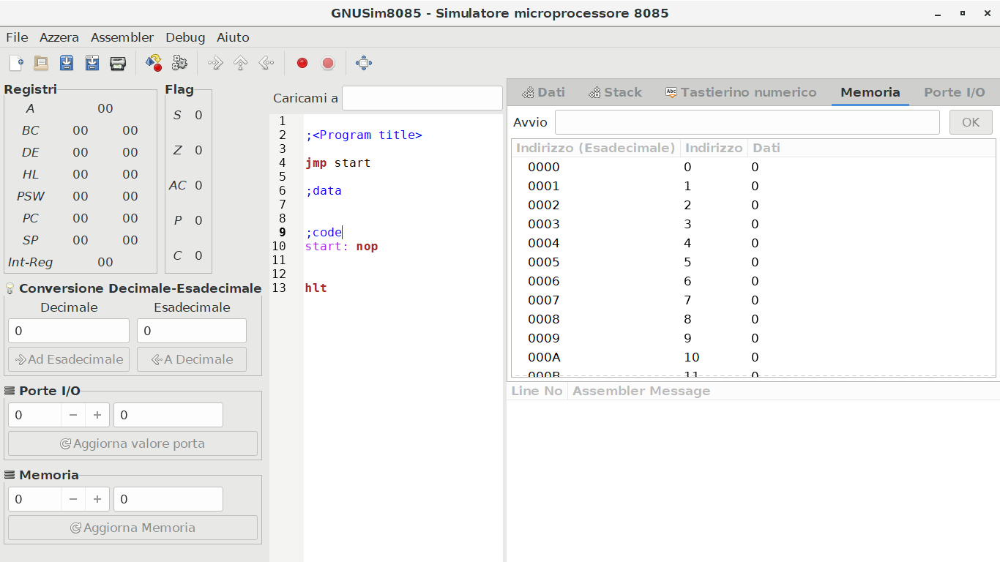
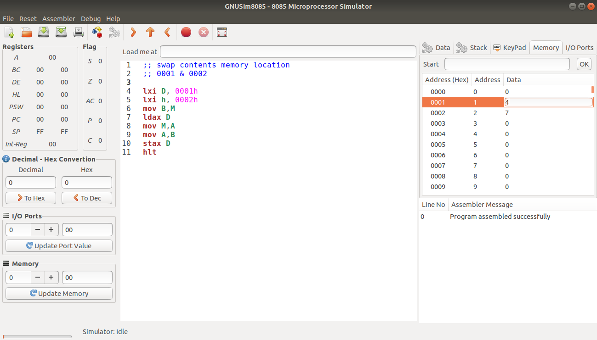

# Current Version (1.3.7)

### Syntax highlighting

### Using breakpoints to find problems in program

### UI available in 12 languages

### Print the assembly listing and take it to lab

### Internationalized UI on Windows

### Easier view and editing for memory, I/O content

### Recently accessed files listed in file dialogs

